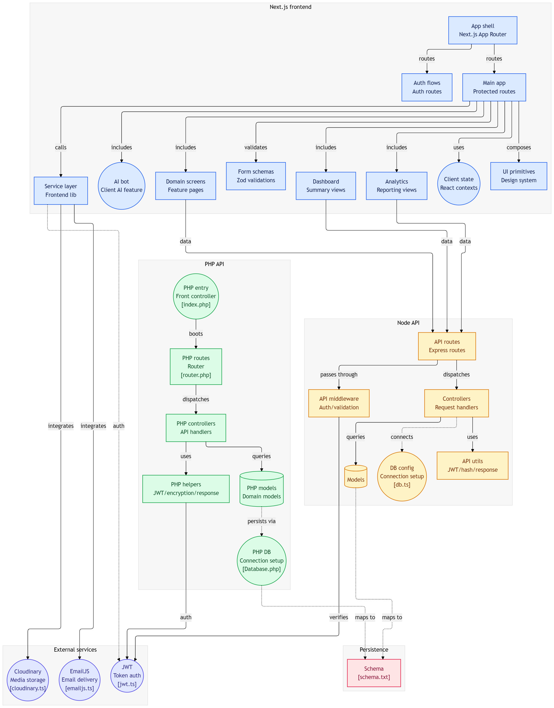

# 📦 Inventory Management System

A **full-stack inventory management platform** designed to manage products, stock levels, transactions, analytics, and AI-assisted workflows.

The system uses a **Next.js frontend**, a **Node.js API (primary backend)**, and includes a **PHP API reference implementation** for interoperability or migration scenarios.

---

# 🧩 System Overview

This project is structured into three major layers:

1. **Frontend — Next.js App Router**
2. **Node API — Express backend**
3. **PHP API — Alternative backend reference**
4. **External services — Email, Media, Auth**

The architecture supports:


* Inventory tracking 📦
* Product and stock management
* Analytics dashboards 📊
* AI-powered assistant 🤖
* Authentication and authorization 🔐
* Reporting workflows
* Modular API structure

---

# 🖥️ Frontend — Next.js

Built using **Next.js App Router**, the frontend provides UI workflows and connects to backend APIs.

## Key Features

* Auth routes and protected routes 🔐
* Dashboard summary views 📊
* Analytics and reporting pages 📈
* Domain feature screens
* AI chatbot integration 🤖
* Client state management
* Form validation using Zod

## Frontend Architecture

```text
App Shell (Next.js App Router)
│
├── Auth Routes
├── Protected Routes
│
├── Dashboard Views
├── Analytics Views
├── Domain Screens
│
├── Form Validation (Zod)
├── React Context State
├── Service Layer (API calls)
│
└── UI Design System
```

---

# ⚙️ Node API — Primary Backend

This is the **main production backend**, built using:

* Node.js
* Express.js
* JWT authentication
* Modular controllers
* Database models
* Middleware pipeline

## Responsibilities

* API routing
* Authentication
* Request validation
* Business logic
* Database queries
* Response formatting

## Flow

```text
Routes → Middleware → Controllers → Models → Database
```

## Node Backend Structure

```text
node-api/
│
├── routes/
│   └── Express routes
│
├── middleware/
│   ├── Auth validation
│   └── Request validation
│
├── controllers/
│   └── API request handlers
│
├── models/
│   └── Database models
│
├── utils/
│   ├── JWT helpers
│   ├── Hashing
│   └── Response utilities
│
└── db.ts
```

---

# 🐘 PHP API — Reference Backend

The PHP backend is included as an **alternative implementation**.

It demonstrates:

* Classic MVC-style routing
* Controller handling
* Model-based database queries
* JWT authentication
* Encryption helpers

Useful for:

* Legacy compatibility
* Migration comparison
* Multi-backend support

## Flow

```text
index.php → router.php → controllers → models → database
```

---

# 🗄️ Database Layer

The system uses a **shared schema structure**.

Handles:

* Inventory records
* Products
* Transactions
* Users
* Logs

Persistence flow:

```text
Models → Schema → Database
```

---

# 🔐 Authentication

Authentication is handled using:

* JWT tokens
* Token verification
* Secure password hashing

Used across:

* Node API
* PHP API
* Frontend protected routes

---

# 🤖 AI Integration

Includes client-side AI integration for:

* Smart recommendations
* Inventory insights
* Assistant workflows
* Reporting automation

---

# 🌐 External Services

The system integrates with:

* ☁️ Cloudinary — Media storage
* 📧 EmailJS — Email delivery
* 🔐 JWT Service — Authentication

---

# 📊 Features

Core capabilities:

* Product management 📦
* Stock tracking
* Order recording
* Inventory adjustments
* Reporting dashboards 📊
* Analytics views 📈
* Authentication system 🔐
* AI workflow assistant 🤖

---

# 🚀 Installation

## Clone Repository

```bash
git clone <repo-url>
cd inventory-system
```

---

## Install Frontend

```bash
cd frontend
npm install
npm run dev
```

---

## Install Node API

```bash
cd node-api
npm install
npm run dev
```

---

## PHP API Setup (Optional)

Place project in a PHP server directory:

```bash
htdocs/
```

Configure:

```text
Database.php
router.php
index.php
```

---

# 🔧 Environment Variables

Example:

```env
JWT_SECRET=your_secret
DB_URL=your_database_url
EMAIL_SERVICE_KEY=your_email_key
CLOUDINARY_KEY=your_cloudinary_key
```

---

# 🧱 Architecture Principles

This project follows:

* Modular feature separation
* Layered architecture
* API-first design
* Reusable service logic
* Scalable routing structure

---

# 🧪 Testing

Recommended:

```bash
npm run test
```

Supports:

* API testing
* Route validation
* Authentication testing

---

# 📦 Deployment

Suggested deployment:

Frontend:

* Vercel
* Netlify

Backend:

* Docker
* VPS
* Cloud VM

Database:

* PostgreSQL / MySQL

---

# 📌 Use Cases

Designed for:

* Warehouses
* Retail stores
* Distribution centers
* Inventory-heavy operations
* SaaS inventory platforms

---

# 🛠️ Future Improvements

Planned enhancements:

* Role-based access control
* Audit logs
* Export reports (PDF/CSV)
* Real-time stock sync
* Notification system

---

# 📄 License

Private or internal project usage.
